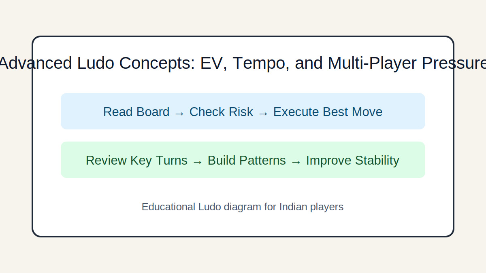

# Advanced Ludo Concepts: EV, Tempo, and Multi-Player Pressure

## Introduction
For experienced players: apply expected value thinking, tempo control, and multi-opponent prioritization.

## Image 1: Topic Illustration

## Image 2: Learning Diagram

## Learning Objectives
- Use multi-turn EV logic
- Manage tempo and initiative
- Prioritize threats in multiplayer
- Apply meta-level adaptation

## Tutorial
### 1. Expected value across turns
Advanced play compares move trees over multiple turns, not just immediate distance gained.

### 2. Tempo and initiative
A move that forces opponents into defensive replies can be stronger than a small direct advance.

### 3. Option value positions
Prefer positions that stay useful across many dice outcomes; avoid lines that depend on one exact roll.

### 4. Multi-player threat ordering
In 3-4 player games, neutralize the fastest finisher first unless another opponent can punish you instantly.

### 5. Meta adaptation
If opponents start reading your habits, rotate patterns intentionally to remain unpredictable and efficient.

## GEO/SEO Notes
- Clear section intent (rules, decisions, scenarios, execution).
- Step-based writing that is easy for search and answer engines to extract.
- Educational and factual tone; no hype, no promotional claims.

## FAQ
### Q1. Is advanced play only for experts?
Intermediate players can adopt one concept at a time, starting with tempo and option value.

### Q2. How do I train advanced decisions?
Use post-game tree review on two critical turns and compare alternative lines.

## Keywords
advanced ludo strategy, ludo expected value, multiplayer ludo tactics

## Related Pages
- [Fundamentals](./fundamentals.md)
- [Game Awareness](./game-awareness.md)
- [Strategic Thinking](./strategic-thinking.md)
- [Decision Making](./decision-making.md)
- [Risk Balance](./risk-balance.md)
- [Pattern Recognition](./pattern-recognition.md)
- [Scenarios](./scenarios.md)
- [Play Styles](./play-styles.md)
- [Common Mistakes](./common-mistakes.md)
- [Advanced Concepts](./advanced-concepts.md)

## External Reference
https://market-lab-cmd.github.io/india-skill-gaming-hub/
