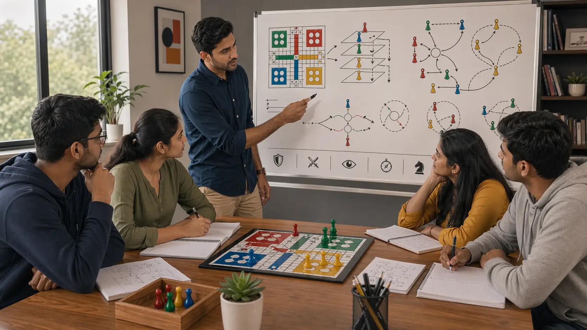

# Ludo Advanced Concepts for Players Who Already Know the Basics

## 🪶 Introduction

Ludo advanced concepts become useful only after the basics are stable. If a player still struggles with release timing, board shape, or obvious threat reading, advanced ideas usually create more confusion than improvement. But once the fundamentals are dependable, deeper concepts can explain why stronger players seem calmer, harder to punish, and better at steering messy games.

This guide presents Ludo advanced concepts as a practical extension of real play. It focuses on why these ideas matter, what they look like in actual games, why players misuse them, and how to apply them without turning simple positions into unnecessary theory.

---

## 🖼️ Advanced Concepts Overview

---

## 🎯 What Makes a Concept Advanced in Ludo?

An advanced concept in Ludo is not just a complicated idea. It is an idea that becomes valuable when you can already handle the basics automatically. Usually, these concepts deal with timing, layered pressure, opponent adaptation, deception of intention, and understanding the true meaning of a position beyond the most obvious move.

Advanced does not mean flashy. Often it simply means more accurate.

---

# 🧠 1. Advanced Concepts Should Refine, Not Replace, Fundamentals
The first mistake players make with advanced material is treating it as a shortcut past the basics. They want sophisticated answers before they have stable ordinary habits. That usually creates fragile play.

The better approach is to use advanced concepts to sharpen what you already know. For example, deeper timing ideas become useful only when your release and spacing decisions are already sound.

# 🧠 2. Learn to Value Tempo Without Worshipping Speed
Tempo in Ludo is not just moving quickly. It is gaining useful initiative without damaging your structure. Sometimes a move that looks slower actually preserves tempo better because it keeps your next options stronger and prevents opponents from taking over the flow of the board.

Players misuse this concept when they reduce tempo to raw advancement. Real tempo is about control over the next phase of play.

# 🧠 3. Understand Layered Pressure
One advanced idea is that pressure can come from more than one source at the same time. A token may seem safe from any one opponent, but the lane as a whole may be becoming hostile. Or an attack move may seem optional until you notice that it also supports your race and limits an opponent's reply.

Layered pressure matters because advanced players often win by combining small advantages rather than chasing one dramatic swing.

# 🧠 4. Manage Board Image and Predictability
Against attentive opponents, your repeated habits become information. If you always chase cuts, always protect the same way, or always push a leader at first opportunity, your play becomes easier to read.

This does not mean acting randomly. It means understanding when your habits are becoming too transparent. Sometimes a quieter move has value simply because it prevents your plan from being obvious.

# 🧠 5. Recognize Hidden Turning Points
In many reviewed games, the real turning point is not the capture everyone remembers. It is the earlier move that changed the board's logic. Maybe one player gave up flexibility, maybe another created layered pressure, maybe a safe square was left too casually.

Advanced players improve faster because they look for those hidden turning points. That is where the most useful lessons usually live.

# 🧠 6. Use Opponent Adaptation as Information
At stronger tables, opponents respond to your tendencies. If your usual lines stop working, the explanation may not be bad luck. It may be that your patterns have become readable.

This matters because advanced play is interactive. Your best move depends not only on the board, but on how others are learning from your behavior.

# 🧠 7. Study Marginal Decisions, Not Only Obvious Blunders
Big mistakes are easy to identify. Marginal decisions are harder, but they teach more. These are the turns where two moves were both plausible and the difference came from subtle trade-offs in pressure, flexibility, or timing.

Advanced improvement usually happens here. Once the obvious errors disappear, the close decisions become the real classroom.

# 🧠 8. Keep Advanced Play Practical
Perhaps the most important advanced concept is restraint. If a simple move is clearly strong, there is no reward for choosing the more complicated line just because it feels sophisticated. Advanced players are not trying to look advanced. They are trying to be accurate.

That mindset protects you from overthinking and keeps your deeper knowledge useful on the board.

# 🧠 9. Build Advanced Understanding Through Honest Review
After a game, ask questions that go deeper than result and surface tactics. Where did the board start favoring one side? Which habits became predictable? Which move changed the tempo without looking dramatic? Where did I mistake visible progress for true control?

These questions help advanced concepts grow out of experience rather than out of borrowed theory.

---

## ⚠️ Common Mistakes

- Studying advanced ideas before basic board habits are stable.
- Treating tempo as pure speed.
- Forcing complex moves when simple ones are clearly better.
- Ignoring how predictable habits affect stronger opponents.
- Reviewing only obvious blunders and missing hidden turning points.

---

## ❓ FAQ

### When should I study advanced concepts in Ludo?
Usually after your fundamentals, common mistakes, and decision process feel reasonably stable during real games.

### Is advanced play mostly about mind games?
No. It is more about accuracy in timing, pressure, adaptation, and review than about dramatic trickery.

### How do I stop overthinking advanced ideas?
Ask whether the concept improves a real board decision right now. If not, return to the simplest strong move.

### What is the best way to train advanced understanding?
Review close decisions and hidden turning points, not just obvious blunders.

---

## 🧾 Summary

Useful Ludo advanced concepts make your strong basics more precise. They help you understand tempo, layered pressure, predictability, opponent adaptation, and hidden turning points without losing touch with practical board play. Better advanced Ludo strategy is not about complexity for its own sake. It is about seeing more truth in the same position.

---

## 🔥 SEO Keywords

ludo advanced concepts
advanced ludo strategy
how to improve at ludo strategy
ludo deeper strategy
ludo advanced play guide

---

## Related Pages
- [Ludo Pattern Recognition](./pattern-recognition.md)
- [Ludo Strategic Thinking](./strategic-thinking.md)
- [Ludo Play Styles](./play-styles.md)
- [Ludo Scenarios](./scenarios.md)
