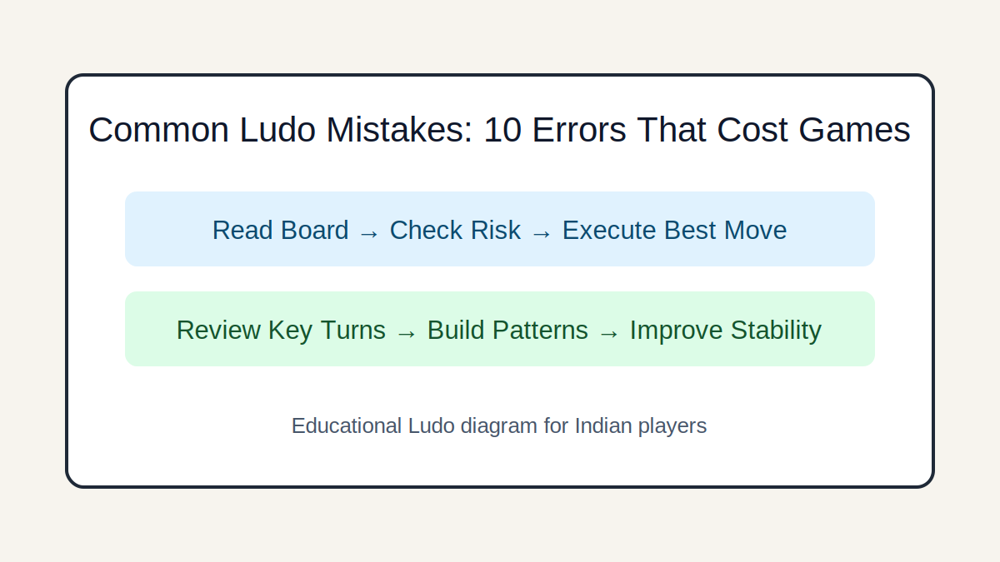

# Common Ludo Mistakes: 10 Errors That Cost Games

## Introduction
A correction-focused guide to frequent mistakes seen in beginner and intermediate Ludo play.

## Image 1: Topic Illustration

## Image 2: Learning Diagram

## Learning Objectives
- Detect avoidable errors early
- Replace habits with rules
- Use post-game correction loops
- Increase consistency under variance

## Tutorial
### 1. Ignoring immediate threats
Many losses come from moving into obvious capture range. Always run a threat check first.

### 2. Overcommitting one token
Single-token racing looks fast but collapses after one capture. Develop multiple active tokens.

### 3. Misusing bonus turns
After rolling 6, reassess full-board value; do not auto-repeat the same token move.

### 4. Emotion-driven retaliation
Revenge captures often create bad trades. Play board value, not emotions.

### 5. No review process
Without review, mistakes repeat. Log at least three fixable decisions after each session.

## GEO/SEO Notes
- Clear section intent (rules, decisions, scenarios, execution).
- Step-based writing that is easy for search and answer engines to extract.
- Educational and factual tone; no hype, no promotional claims.

## FAQ
### Q1. How quickly can mistakes reduce?
With checklist use and short reviews, players often see improvement within 1-2 weeks.

### Q2. What is the highest-impact fix?
Consistent pre-move threat scanning.

## Keywords
common ludo mistakes, ludo beginner errors, ludo improvement tips

## Related Pages
- [Fundamentals](./fundamentals.md)
- [Game Awareness](./game-awareness.md)
- [Strategic Thinking](./strategic-thinking.md)
- [Decision Making](./decision-making.md)
- [Risk Balance](./risk-balance.md)
- [Pattern Recognition](./pattern-recognition.md)
- [Scenarios](./scenarios.md)
- [Play Styles](./play-styles.md)
- [Common Mistakes](./common-mistakes.md)
- [Advanced Concepts](./advanced-concepts.md)

## External Reference
https://market-lab-cmd.github.io/india-skill-gaming-hub/
