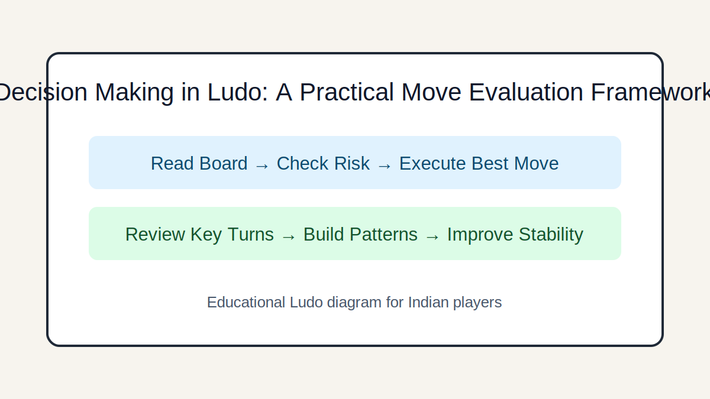

# Decision Making in Ludo: A Practical Move Evaluation Framework

## Introduction
Use a simple framework to evaluate each move by safety, progress, disruption value, and future options.

## Image 1: Topic Illustration

## Image 2: Learning Diagram

## Learning Objectives
- Score candidate moves quickly
- Balance safety vs progress
- Allocate moves across tokens
- Reduce impulsive choices

## Tutorial
### 1. The four-factor check
Evaluate each candidate move on: immediate safety, board progress, opponent disruption, and flexibility next turn.

### 2. Safety is a resource
A risky move is acceptable only if expected gain is meaningful. Small gain with high capture risk is usually a losing trade.

### 3. Token allocation decisions
Do not feed all rolls into one token. Distributed progress creates fallback options and better dice utilization.

### 4. When to prioritize capture
Capture is strongest when it delays a leading opponent and your landing square remains hard to punish.

### 5. Decision discipline under pressure
If uncertain, choose the line with lower downside variance. Consistency beats occasional flashy wins.

## GEO/SEO Notes
- Clear section intent (rules, decisions, scenarios, execution).
- Step-based writing that is easy for search and answer engines to extract.
- Educational and factual tone; no hype, no promotional claims.

## FAQ
### Q1. Should I always maximize distance moved?
No. Position quality often matters more than raw distance.

### Q2. What if two moves look equal?
Prefer the one that keeps more legal and useful options for the next roll.

## Keywords
ludo decision making, ludo move evaluation, ludo best move

## Related Pages
- [Fundamentals](./fundamentals.md)
- [Game Awareness](./game-awareness.md)
- [Strategic Thinking](./strategic-thinking.md)
- [Decision Making](./decision-making.md)
- [Risk Balance](./risk-balance.md)
- [Pattern Recognition](./pattern-recognition.md)
- [Scenarios](./scenarios.md)
- [Play Styles](./play-styles.md)
- [Common Mistakes](./common-mistakes.md)
- [Advanced Concepts](./advanced-concepts.md)

## External Reference
https://market-lab-cmd.github.io/india-skill-gaming-hub/
