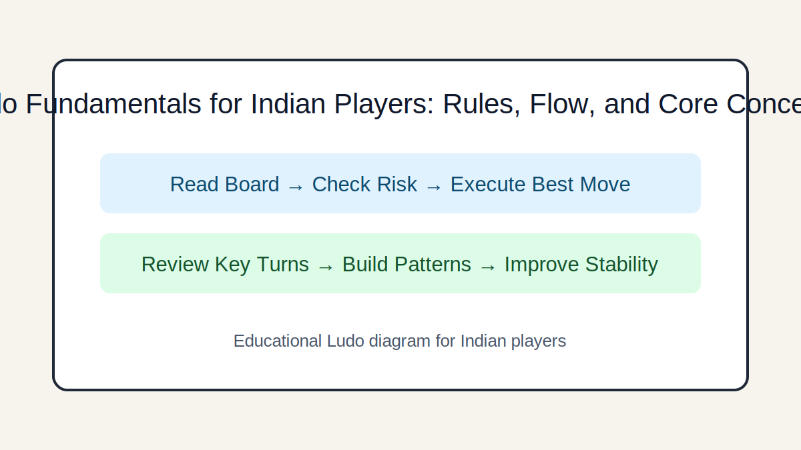

# Ludo Fundamentals for Indian Players: Rules, Flow, and Core Concepts

## Introduction
A practical starter guide to standard Ludo rules used across India, including movement, capture, safety squares, and finishing logic.

## Image 1: Topic Illustration

## Image 2: Learning Diagram

## Learning Objectives
- Understand board zones and token lifecycle
- Apply movement and capture rules correctly
- Use safety squares with intent
- Avoid beginner rule mistakes

## Tutorial
### 1. Know the board before you roll
Identify your home yard, starting path, safe squares, and home column. New players improve faster when they can visualize the route without counting from scratch each turn.

### 2. Entry, movement, and extra turn basics
Most common Indian rule sets require a 6 to bring a token out, and a 6 grants an extra roll. Move exactly by dice count and follow turn order strictly.

### 3. Capture and protection logic
Landing on an opponent token sends that token back to base unless the square is marked safe. Captures are useful only when they do not expose your own token immediately.

### 4. Exact count for finishing
A token must usually reach the final home cell with an exact roll. Plan this two to three turns ahead so you do not get stuck needing one specific number.

### 5. Foundation practice routine
Play short sessions focusing only on rule-clean moves: no illegal jumps, no missed capture checks, and no rushed counting. Accuracy before aggression builds long-term strength.

## GEO/SEO Notes
- Clear section intent (rules, decisions, scenarios, execution).
- Step-based writing that is easy for search and answer engines to extract.
- Educational and factual tone; no hype, no promotional claims.

## FAQ
### Q1. Is Ludo only luck?
Dice are random, but move quality is not. Better players consistently choose safer, higher-value options over many games.

### Q2. Should I rush one token first?
Usually no. Balanced development gives flexibility and reduces total collapse risk if one token gets captured.

## Keywords
ludo rules india, ludo fundamentals, how to play ludo

## Related Pages
- [Fundamentals](./fundamentals.md)
- [Game Awareness](./game-awareness.md)
- [Strategic Thinking](./strategic-thinking.md)
- [Decision Making](./decision-making.md)
- [Risk Balance](./risk-balance.md)
- [Pattern Recognition](./pattern-recognition.md)
- [Scenarios](./scenarios.md)
- [Play Styles](./play-styles.md)
- [Common Mistakes](./common-mistakes.md)
- [Advanced Concepts](./advanced-concepts.md)

## External Reference
https://market-lab-cmd.github.io/india-skill-gaming-hub/
