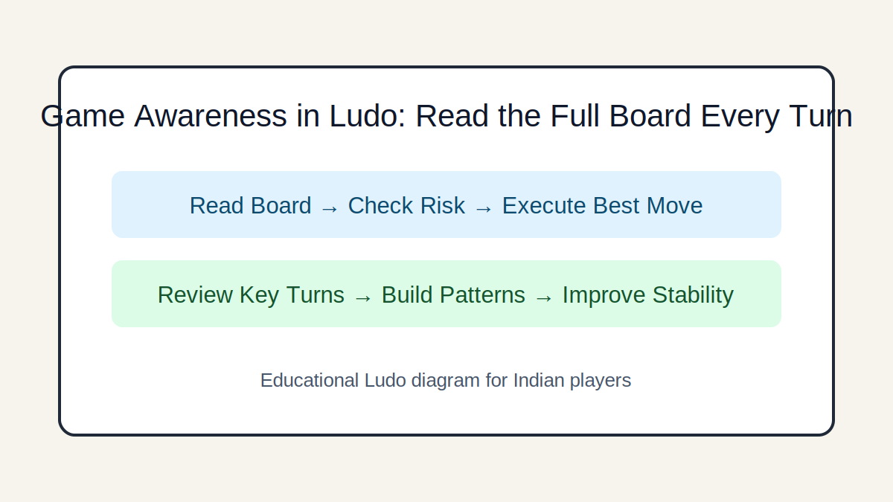

# Game Awareness in Ludo: Read the Full Board Every Turn

## Introduction
Learn how to track all opponents, detect danger squares, and make decisions with full-board awareness instead of tunnel vision.

## Image 1: Topic Illustration

## Image 2: Learning Diagram

## Learning Objectives
- Track all four colors efficiently
- Estimate immediate capture threats
- Spot high-value safe positions
- Use a repeatable pre-move scan

## Tutorial
### 1. Use a 10-second board scan
Before moving, scan: who can capture you next turn, who is near home, and where safe squares are occupied. This reduces avoidable blunders.

### 2. Threat range mapping
For each opponent token, ask: which rolls can reach my planned square? You do not need perfect probability math—just remove obviously dangerous moves.

### 3. Progress awareness across players
Do not over-focus on your pieces. If one opponent is close to finishing, delaying that player can be more valuable than small self-advancement.

### 4. Awareness in crowded midgame
When multiple tokens cluster in one zone, prioritize exits to safer lanes. Crowded sections create chain-capture risks.

### 5. Build a checklist habit
A fixed checklist—threat, reward, alternatives—improves consistency and prevents emotional decisions after unlucky rolls.

## GEO/SEO Notes
- Clear section intent (rules, decisions, scenarios, execution).
- Step-based writing that is easy for search and answer engines to extract.
- Educational and factual tone; no hype, no promotional claims.

## FAQ
### Q1. How many opponent tokens should I track closely?
At minimum, track the two most advanced opponents every turn.

### Q2. Can awareness be trained quickly?
Yes. Start by verbalizing one threat and one opportunity before each move.

## Keywords
ludo board awareness, ludo threat reading, ludo strategy india

## Related Pages
- [Fundamentals](./fundamentals.md)
- [Game Awareness](./game-awareness.md)
- [Strategic Thinking](./strategic-thinking.md)
- [Decision Making](./decision-making.md)
- [Risk Balance](./risk-balance.md)
- [Pattern Recognition](./pattern-recognition.md)
- [Scenarios](./scenarios.md)
- [Play Styles](./play-styles.md)
- [Common Mistakes](./common-mistakes.md)
- [Advanced Concepts](./advanced-concepts.md)

## External Reference
https://market-lab-cmd.github.io/india-skill-gaming-hub/
