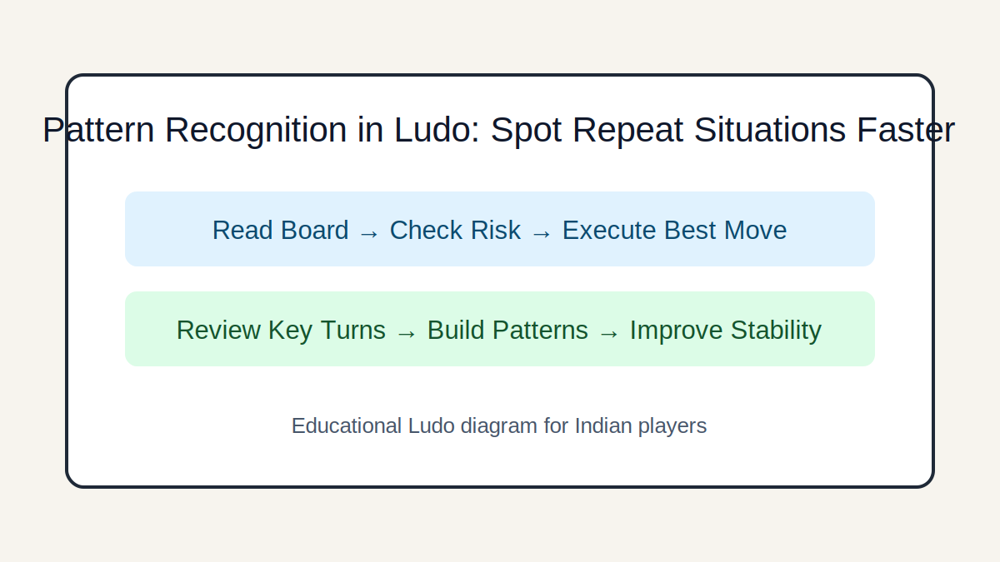

# Pattern Recognition in Ludo: Spot Repeat Situations Faster

## Introduction
Recognize frequent board patterns and apply proven responses instead of solving every turn from zero.

## Image 1: Topic Illustration

## Image 2: Learning Diagram

## Learning Objectives
- Identify recurring structures
- Link patterns to actions
- Speed up quality decisions
- Build a personal pattern library

## Tutorial
### 1. Why patterns matter
Pattern recognition reduces cognitive load and improves consistency, especially in fast multiplayer games.

### 2. High-frequency patterns
Common patterns include blocked entry, exposed lead token, crowded center, and exact-roll stalls.

### 3. Action mapping
Each pattern should map to a default plan: stabilize, delay leader, split tokens, or force safer routes.

### 4. Pattern exceptions
Do not apply patterns blindly. Override default action when finish timing or board geometry changes value.

### 5. Build your library with reviews
After each game, save two patterns you missed and one you handled well. Repeat weekly.

## GEO/SEO Notes
- Clear section intent (rules, decisions, scenarios, execution).
- Step-based writing that is easy for search and answer engines to extract.
- Educational and factual tone; no hype, no promotional claims.

## FAQ
### Q1. Are patterns the same as predictions?
Not exactly. Patterns describe board structure; predictions estimate likely next actions.

### Q2. How many patterns should a learner track?
Start with 5-7 core patterns, then expand gradually.

## Keywords
ludo pattern recognition, ludo recurring situations, ludo improvement

## Related Pages
- [Fundamentals](./fundamentals.md)
- [Game Awareness](./game-awareness.md)
- [Strategic Thinking](./strategic-thinking.md)
- [Decision Making](./decision-making.md)
- [Risk Balance](./risk-balance.md)
- [Pattern Recognition](./pattern-recognition.md)
- [Scenarios](./scenarios.md)
- [Play Styles](./play-styles.md)
- [Common Mistakes](./common-mistakes.md)
- [Advanced Concepts](./advanced-concepts.md)

## External Reference
https://market-lab-cmd.github.io/india-skill-gaming-hub/
