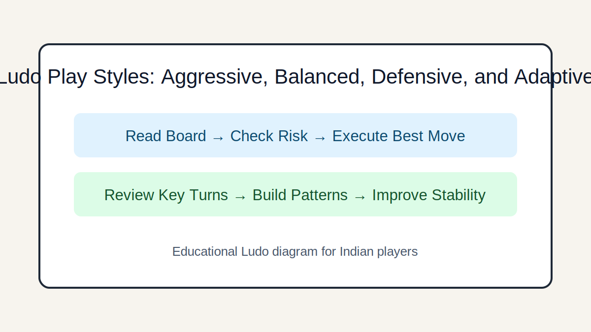

# Ludo Play Styles: Aggressive, Balanced, Defensive, and Adaptive

## Introduction
Understand major play styles in Indian Ludo circles and learn how to counter each without losing your own structure.

## Image 1: Topic Illustration

## Image 2: Learning Diagram

## Learning Objectives
- Identify style signatures
- Exploit style weaknesses
- Switch style by phase
- Build adaptive personal style

## Tutorial
### 1. Aggressive style profile
Aggressive players chase captures and tempo swings. Counter by controlling exposure and punishing overextension.

### 2. Defensive style profile
Defensive players preserve tokens and avoid conflict. Counter by increasing positional pressure and forcing decisions.

### 3. Balanced style profile
Balanced players trade safely and adapt moderately. Beat them through sharper timing and scenario-specific spikes.

### 4. Adaptive style advantage
Strong players switch style across phases. Learn to shift from safe opening to decisive endgame aggression.

### 5. Style-aware preparation
Before games, define your default style and two switch triggers so adaptation is intentional, not reactive.

## GEO/SEO Notes
- Clear section intent (rules, decisions, scenarios, execution).
- Step-based writing that is easy for search and answer engines to extract.
- Educational and factual tone; no hype, no promotional claims.

## FAQ
### Q1. Should I copy one pro style?
Use it as a base, then customize to your risk tolerance and local rule set.

### Q2. Can style beat better dice?
Over many games, style discipline improves outcomes despite short-term variance.

## Keywords
ludo play style, aggressive vs defensive ludo, adaptive ludo strategy

## Related Pages
- [Fundamentals](./fundamentals.md)
- [Game Awareness](./game-awareness.md)
- [Strategic Thinking](./strategic-thinking.md)
- [Decision Making](./decision-making.md)
- [Risk Balance](./risk-balance.md)
- [Pattern Recognition](./pattern-recognition.md)
- [Scenarios](./scenarios.md)
- [Play Styles](./play-styles.md)
- [Common Mistakes](./common-mistakes.md)
- [Advanced Concepts](./advanced-concepts.md)

## External Reference
https://market-lab-cmd.github.io/india-skill-gaming-hub/
