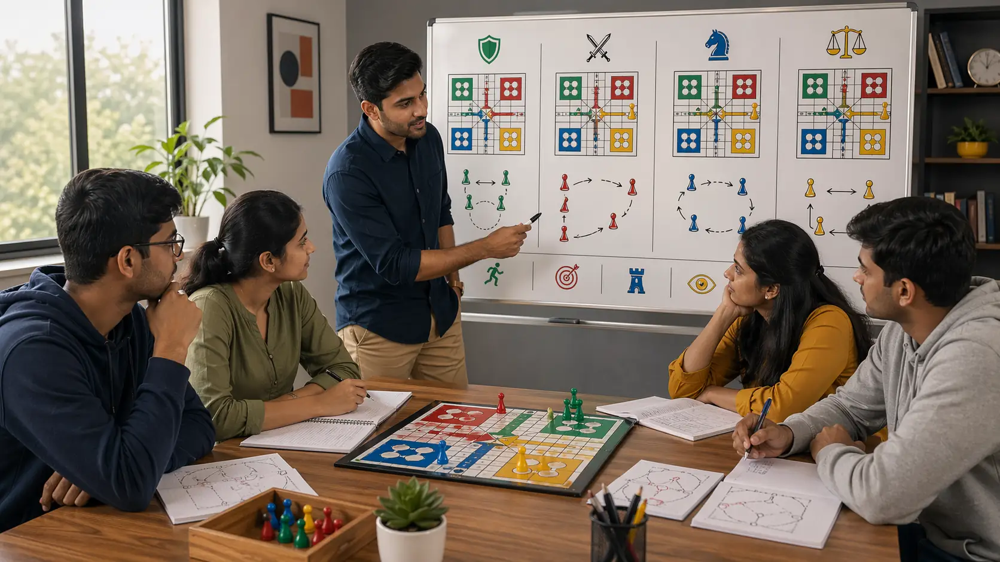

# Ludo Play Styles Guide and How to Use Them Wisely

## 🪶 Introduction

Ludo play styles are useful only when players understand what each style solves and where it starts failing. Many people talk about being aggressive or defensive as if style were a personality choice. In real games, good style is usually just the response that fits the current board.

This guide explains Ludo play styles from a practical teaching perspective. It looks at why styles matter, what real board situations call for them, why players get trapped in one style, and how to adjust without becoming inconsistent.

---

## 🖼️ Play Styles Overview

---

## 🎯 What Are Ludo Play Styles?

Ludo play styles are recurring ways players approach the board. Some prefer pressure and captures. Some prefer safety and structure. Some race early. Some build gradually. These tendencies are normal, but they become strategic only when they are used consciously.

A strong player has a preferred style, but not a fixed one. The board should influence the style more than the ego does.

---

# 🧠 1. Why Ludo Play Styles Matter
Style matters because it shapes what you notice first. Aggressive players often notice cuts and tempo. Cautious players often notice danger and structure. Fast racers notice finishing lanes quickly. Balanced players look for flexible positions.

None of these habits are automatically wrong. Problems start when style becomes blind loyalty. Then the board changes, but the player's thinking does not.

# 🧠 2. The Aggressive Style and Where It Works
Aggressive Ludo play usually means valuing captures, pressure, and tempo. It works best when opponents are overextended, when your tokens have backup routes, or when one sharp move can disrupt a fragile enemy structure.

The common misread is confusing aggression with constant action. Real aggression is selective. If your attacking move leaves your board loose and unsupported, it is often just impatience wearing an aggressive label.

# 🧠 3. The Safe Style and Its Hidden Value
A safety-first style is often underestimated because it looks less dramatic. But careful play can quietly build stronger finishing chances by preserving board health, reducing free targets, and keeping future rolls usable.

The weakness of this style appears when safety becomes fear. If you never leave a comfortable square, never challenge weak enemy structure, and always avoid productive tension, your play becomes too passive to win strong races.

# 🧠 4. The Racing Style and Why It Can Backfire
Some players naturally want to advance the most progressed token at every chance. This racing style can be strong when the path ahead is clean, opponents are undeveloped, and quick conversion reduces future complexity.

It becomes dangerous when the race is visually tempting but structurally weak. A leading token without support often creates the illusion of control. In review, the race was not wrong because speed is bad. It was wrong because the board behind the leader was empty.

# 🧠 5. The Balanced Style Usually Ages Best
Balanced play styles are less exciting to describe, but they often produce the most reliable improvement. Balanced players develop multiple tokens, respect danger without becoming timid, and switch between pressure and stability as the board asks.

This style works well for learning because it teaches adaptation. You are not forcing the game into one emotional rhythm. You are reading what the board actually needs.

# 🧠 6. Why Players Get Stuck in One Style
Most style problems come from comfort. Players keep repeating the kind of move that matches their personality or the kind of win they remember most vividly. An aggressive player remembers the heroic cut. A cautious player remembers the disaster that followed one careless sprint.

Those memories are real, but they can distort judgment. The correction is not abandoning your style completely. It is learning where that style starts telling incomplete stories.

# 🧠 7. Match Style to Board State, Not Mood
This is the teaching rule that matters most: use the style the board rewards, not the style your mood prefers. If your position is fragile, forced aggression often makes it worse. If the board is offering a narrow but valuable attack, overcautious play may waste the moment.

In practical terms, ask what the current board needs more of: stability, development, pressure, or speed. The answer tells you more than a fixed style label ever will.

# 🧠 8. Review Your Style Bias Honestly
After a game, style review can be simple. Ask whether you leaned too hard into your default tendency. Did you push because waiting felt boring? Did you protect because risk felt emotionally uncomfortable? Did you chase speed because the lead looked too tempting?

These questions matter because style bias is often emotional before it is strategic. Once you see the emotional pattern, adaptation becomes easier.

# 🧠 9. Build a Flexible Identity as a Player
The strongest long-term goal is not to become purely aggressive, defensive, or racing-oriented. It is to become the kind of player who can shift gears without confusion. That flexibility makes you harder to predict and more capable of handling different board types.

A mature Ludo style is not one habit repeated forever. It is a set of responses you can trust in the right situations.

---

## ⚠️ Common Mistakes

- Treating play style as personality instead of board-dependent strategy.
- Calling impatience "aggression."
- Calling fear "safe play."
- Racing one token because it feels exciting, not because the structure supports it.
- Refusing to adapt because a preferred style has worked before.

---

## ❓ FAQ

### What is the best play style in Ludo?
There is no single best style. Balanced and adaptable play usually performs best over time because it fits more board types.

### Is aggressive play stronger than safe play?
Only when the board supports it. Aggression without structure is often self-destructive.

### How do I know my own style bias?
Review what kind of move you choose first under pressure. That first instinct often reveals your default style.

### Should beginners focus on one style?
Beginners usually improve more from balanced habits than from forcing a strong style identity too early.

---

## 🧾 Summary

Ludo play styles are useful when they help you understand the board, not when they trap you inside one habit. Aggressive, safe, racing, and balanced approaches all have real value, but each works only in the right context. Better Ludo play comes from adapting your style to the board, not defending your favorite style at all costs.

---

## 🔥 SEO Keywords

ludo play styles
aggressive vs defensive ludo
ludo playing style guide
best ludo style
ludo strategy styles

---

## Related Pages
- [Ludo Strategic Thinking](./strategic-thinking.md)
- [Ludo Risk Balance](./risk-balance.md)
- [Ludo Advanced Concepts](./advanced-concepts.md)
- [Ludo Scenarios](./scenarios.md)
