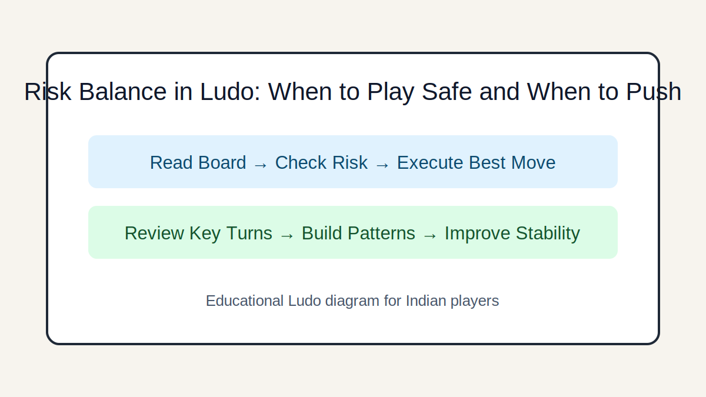

# Risk Balance in Ludo: When to Play Safe and When to Push

## Introduction
Understand calculated risk in Ludo using game phase, opponent pressure, and recoverability of mistakes.

## Image 1: Topic Illustration

## Image 2: Learning Diagram

## Learning Objectives
- Assess risk-reward correctly
- Set risk limits by phase
- Respond to aggressive opponents
- Avoid emotional overextension

## Tutorial
### 1. Define acceptable risk
Accept risk when upside is game-shaping; avoid it when upside is minor and downside resets your tempo.

### 2. Opening risk profile
Early game should be moderately conservative: mobilize tokens while avoiding unnecessary exposure.

### 3. Midgame pressure choices
Take tactical risks only with clear purpose—capture lead token, secure block, or create protected sprint lanes.

### 4. Endgame risk shift
As finish windows tighten, speed may outweigh safety. Controlled aggression is valid when time is the main constraint.

### 5. Recoverability test
Before risky moves, ask: if this fails, can I recover within 2-3 turns? If not, downgrade the risk.

## GEO/SEO Notes
- Clear section intent (rules, decisions, scenarios, execution).
- Step-based writing that is easy for search and answer engines to extract.
- Educational and factual tone; no hype, no promotional claims.

## FAQ
### Q1. Is conservative play always better?
No. Overly safe play can lose races to efficient aggressive opponents.

### Q2. How do I stop tilt after a bad capture?
Use a reset routine: deep breath, threat scan, then return to checklist-based decisions.

## Keywords
ludo risk management, ludo safe vs aggressive, ludo strategy guide

## Related Pages
- [Fundamentals](./fundamentals.md)
- [Game Awareness](./game-awareness.md)
- [Strategic Thinking](./strategic-thinking.md)
- [Decision Making](./decision-making.md)
- [Risk Balance](./risk-balance.md)
- [Pattern Recognition](./pattern-recognition.md)
- [Scenarios](./scenarios.md)
- [Play Styles](./play-styles.md)
- [Common Mistakes](./common-mistakes.md)
- [Advanced Concepts](./advanced-concepts.md)

## External Reference
https://market-lab-cmd.github.io/india-skill-gaming-hub/
