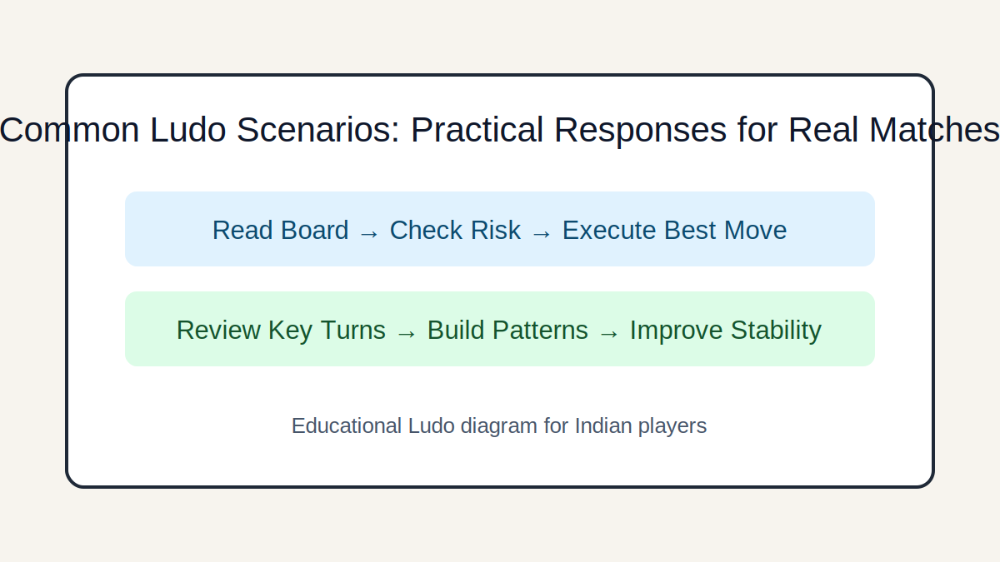

# Common Ludo Scenarios: Practical Responses for Real Matches

## Introduction
A scenario-based guide for typical match states such as early lead, blocked entry, crowded center, and final race.

## Image 1: Topic Illustration

## Image 2: Learning Diagram

## Learning Objectives
- Recognize scenario type quickly
- Apply scenario-specific priorities
- Avoid overgeneralized play
- Improve late-game choices

## Tutorial
### 1. Early leader on board
If you lead, protect tempo and avoid unnecessary duels. If chasing, target efficient disruption over random aggression.

### 2. Blocked entry scenario
When your entry is blocked, switch resources to other tokens and look for forcing lines instead of waiting passively.

### 3. Crowded center traffic
In dense zones, survival value rises. Use safe squares and avoid starting capture chains you cannot finish.

### 4. Three-way contention
Prioritize moves that hurt the strongest rival, even if they are not your immediate neighbor on track.

### 5. Final sprint scenario
When finish windows are tight, choose direct progress lines and minimize turns spent on low-impact defensive play.

## GEO/SEO Notes
- Clear section intent (rules, decisions, scenarios, execution).
- Step-based writing that is easy for search and answer engines to extract.
- Educational and factual tone; no hype, no promotional claims.

## FAQ
### Q1. What is the biggest scenario mistake?
Using one fixed style across all scenarios.

### Q2. How can I improve scenario handling?
Run short review drills: identify scenario type first, then select top two priorities.

## Keywords
ludo scenarios, ludo endgame situations, ludo midgame strategy

## Related Pages
- [Fundamentals](./fundamentals.md)
- [Game Awareness](./game-awareness.md)
- [Strategic Thinking](./strategic-thinking.md)
- [Decision Making](./decision-making.md)
- [Risk Balance](./risk-balance.md)
- [Pattern Recognition](./pattern-recognition.md)
- [Scenarios](./scenarios.md)
- [Play Styles](./play-styles.md)
- [Common Mistakes](./common-mistakes.md)
- [Advanced Concepts](./advanced-concepts.md)

## External Reference
https://market-lab-cmd.github.io/india-skill-gaming-hub/
