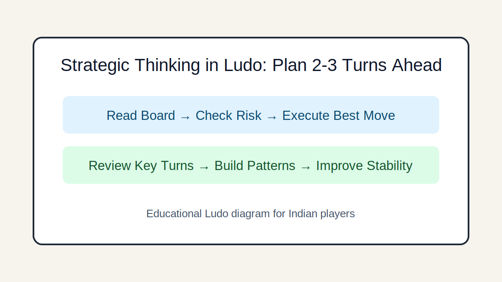

# Strategic Thinking in Ludo: Plan 2-3 Turns Ahead

## Introduction
Build forward-planning habits that work with dice uncertainty: set micro-goals, compare lines, and adapt without panic.

## Image 1: Topic Illustration

## Image 2: Learning Diagram

## Learning Objectives
- Create short planning windows
- Set phase-based priorities
- Anticipate opponent responses
- Adjust plans after board changes

## Tutorial
### 1. Plan by windows, not certainties
Instead of predicting exact rolls, define a 2-3 turn objective: reach safety, open a second token, or block an entry lane.

### 2. Phase-based planning
Opening: mobilize tokens. Midgame: shape position and pressure. Endgame: optimize exact counts and finishing order.

### 3. Line comparison method
Compare at least two move lines before committing. The best line is often the one with stable value across many dice outcomes.

### 4. Think from opponent perspective
Ask what your strongest opponent wants next turn. If your move helps that plan, reconsider.

### 5. Adaptation trigger points
Change strategy when a major event happens: key capture, forced block, or opponent entering finishing window earlier than expected.

## GEO/SEO Notes
- Clear section intent (rules, decisions, scenarios, execution).
- Step-based writing that is easy for search and answer engines to extract.
- Educational and factual tone; no hype, no promotional claims.

## FAQ
### Q1. How far ahead should I plan?
Two turns is enough for most club-level games; go deeper only in critical endgame states.

### Q2. Is flexible planning better than strict plans?
Yes. Ludo rewards robust plans that survive many dice outcomes.

## Keywords
ludo planning ahead, ludo strategic thinking, ludo long term play

## Related Pages
- [Fundamentals](./fundamentals.md)
- [Game Awareness](./game-awareness.md)
- [Strategic Thinking](./strategic-thinking.md)
- [Decision Making](./decision-making.md)
- [Risk Balance](./risk-balance.md)
- [Pattern Recognition](./pattern-recognition.md)
- [Scenarios](./scenarios.md)
- [Play Styles](./play-styles.md)
- [Common Mistakes](./common-mistakes.md)
- [Advanced Concepts](./advanced-concepts.md)

## External Reference
https://market-lab-cmd.github.io/india-skill-gaming-hub/
