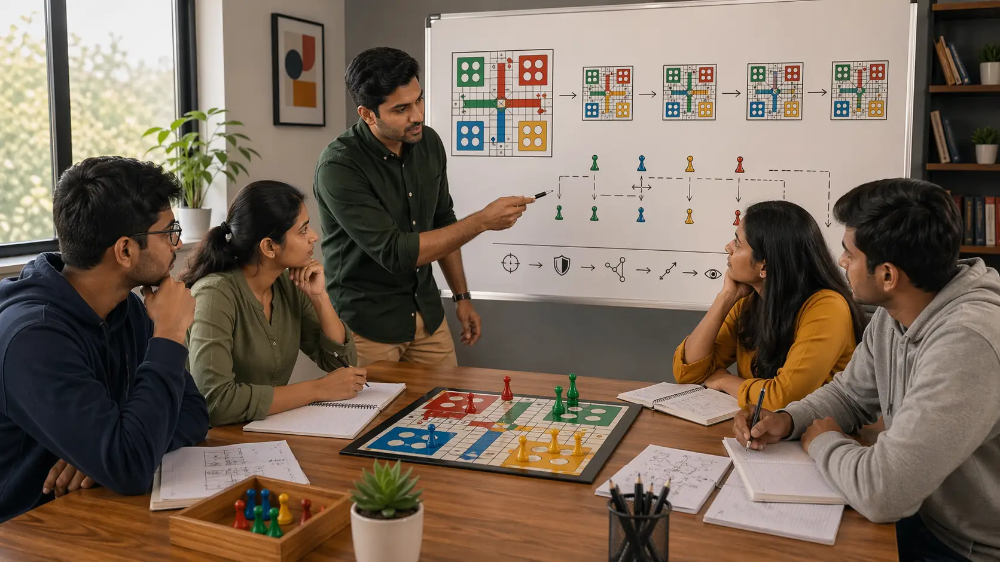

# Ludo Strategic Thinking Guide for Long-Term Board Control

## 🪶 Introduction

Ludo strategic thinking is what helps players move beyond one-turn reactions. Many games are not lost because a player failed to see a tactic. They are lost because the player never formed a clear long-term plan for token development, pressure, safety, and endgame conversion.

This guide explains Ludo strategic thinking in a realistic teaching voice. It focuses on why long-term planning matters, what strong plans look like in real games, why players build weak plans, and how to improve your thinking without becoming too rigid.

---

## 🖼️ Strategic Thinking Overview

---

## 🎯 What Is Ludo Strategic Thinking?

Ludo strategic thinking means connecting your current move to the future shape of the board. It involves planning how your tokens will develop, how pressure will be managed, where safety matters, and what kind of endgame you are trying to create.

Strategy is not a prediction contest. It is a way of giving your moves direction so they work together instead of pulling against each other.

---

# 🧠 1. Why Ludo Strategic Thinking Matters
Without strategic thinking, players often make locally reasonable moves that do not combine into a strong game. One turn they race, the next they defend, then they chase a capture, then they finally release a new token. Each move has a story, but the stories do not connect.

Good strategy gives the board coherence. It tells you what your moves are trying to build over several turns, not just what they achieve immediately.

# 🧠 2. Start With a Board Goal, Not a Fancy Idea
A useful strategic plan begins with a practical goal. Maybe you need wider development. Maybe you need to preserve a lead. Maybe you want to attack an overextended opponent while keeping your own shape stable.

Players get into trouble when they start with an idea that sounds advanced instead of with a board need that is actually real. Good strategy is usually simpler than it sounds.

# 🧠 3. Plan for the Next Shape of the Position
Strategic thinking improves when you ask what the board will probably look like after the next one or two exchanges. Not every line can be mapped deeply, but most positions reward a short planning horizon.

This matters because many weak moves are chosen in isolation. They win the present turn and damage the future one.

# 🧠 4. Connect Token Development to Your Larger Plan
Token development is not just a basic skill. It is also a strategic one. If your long-term plan depends on flexibility, you cannot leave most of your board inactive. If your plan depends on converting a lead quickly, you must know whether the rest of the position can support that race.

Strong planning always checks whether the token structure matches the claimed strategy.

# 🧠 5. Respect Trade-Offs Instead of Pretending They Are Not There
Every real plan gives something up. A safer plan may slow short-term pressure. An aggressive plan may increase exposure. A racing plan may reduce flexibility. Strategic thinking becomes stronger when you name those trade-offs honestly.

Players make weak plans when they describe only the upside. That usually means the plan is not yet mature.

# 🧠 6. Leave Room to Adapt
One danger in strategy is becoming attached to the first plan that made sense. The board changes. Opponents release tokens. pressure lanes open. finishing routes become more or less urgent. A good plan guides you, but it does not trap you.

Adaptation is not inconsistency. It is the sign that your strategy is responding to the real game rather than to a fixed script.

# 🧠 7. Use Opponent Structure in Your Strategic Thinking
Strategy is not only about your tokens. It is also about understanding what kind of structure opponents are building. Are they racing too narrowly? Are they spread too thin? Are they safe but passive?

Thinking this way helps you choose plans that do more than improve your own board. They also interfere with what the other players are trying to accomplish.

# 🧠 8. Review Whether Your Moves Supported the Plan
After the game, ask whether your moves actually served the strategy you thought you were using. Many players say they were trying to build a balanced board, then review shows several turns of emotionally chasing one token.

This review habit matters because it exposes the gap between stated strategy and actual play.

# 🧠 9. Build Strategic Thinking Through Simpler Language
You do not need complicated vocabulary to think strategically. Some of the best review questions are plain: what was I trying to build, what did I weaken, when should I have changed plans, and what kind of endgame was I creating?

Clear language leads to clear strategy. If you cannot explain your plan simply, it may not be stable yet.

---

## ⚠️ Common Mistakes

- Making moves that look reasonable individually but do not support one overall plan.
- Starting with an advanced-sounding idea instead of a real board need.
- Ignoring the trade-offs inside a strategy.
- Staying loyal to a plan after the board has changed.
- Describing strategy vaguely during review.

---

## ❓ FAQ

### What is the difference between strategy and tactics in Ludo?
Tactics solve immediate board moments. Strategy connects those moments into a longer plan.

### How far ahead should I think in Ludo?
Usually one or two exchanges is enough to improve strategic quality. You do not need deep forecasting on every turn.

### Why do my plans collapse midgame?
Often because the plan was never connected to token structure, or because the board changed and the plan was not updated.

### How can I train strategic thinking after a match?
Write down your intended plan, the turn where it stopped fitting the board, and what plan would have matched better after that point.

---

## 🧾 Summary

Strong Ludo strategic thinking comes from giving your moves a practical long-term direction while staying flexible enough to adapt when the board changes. Start with a real board goal, connect token structure to that goal, and review whether your moves truly supported the plan. Better Ludo strategy usually feels clearer, calmer, and more connected from turn to turn.

---

## 🔥 SEO Keywords

ludo strategic thinking
ludo long term strategy
how to think strategically in ludo
ludo planning guide
ludo board strategy

---

## Related Pages
- [Ludo Decision Making](./decision-making.md)
- [Ludo Play Styles](./play-styles.md)
- [Ludo Risk Balance](./risk-balance.md)
- [Ludo Advanced Concepts](./advanced-concepts.md)
